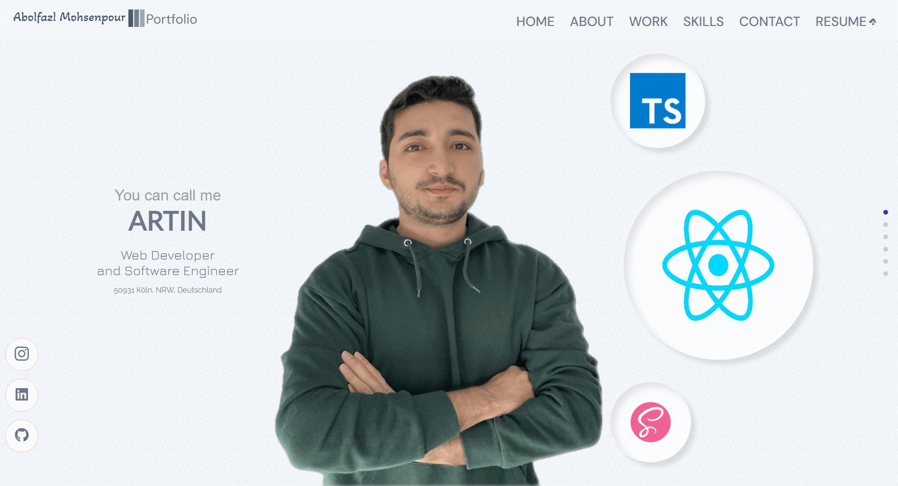

<!DOCTYPE html>
<html lang="en">
<head>
    <meta charset="UTF-8">
    <meta name="viewport" content="width=device-width, initial-scale=1.0">
    <title>Portfolio README</title>
</head>
<body>
    <h1>Abolfazl Mohsenpour's Portfolio Website</h1>
    
Welcome to my portfolio website! This README file provides an overview of the website and a brief explanation of its contents and features.

    <h2>Website Link</h2>
    
Visit my portfolio website: <a href="https://artinmohsenpour.com/" target="_blank">artinmohsenpour.com</a>

    <h2>Features</h2>
    <ul>
        <li><strong>Responsive Design</strong>: The website is fully responsive, ensuring a seamless experience across all devices.</li>
        <li><strong>Modern Technologies</strong>: Built with modern web technologies including React, Next.js, and SCSS.</li>
        <li><strong>User Experience</strong>: Focused on providing a user-friendly interface with easy navigation.</li>
        <li><strong>Project Showcase</strong>: Detailed descriptions and demonstrations of my past projects, highlighting my skills and contributions.</li>
    </ul>
    <h2>Screenshot</h2>
    
Here is a preview of my portfolio website:

    
    <h2>Contact Information</h2>
    
<strong>Abolfazl Mohsenpour</strong> 
    Web Developer and Software Engineer 
    Email: <a href="mailto:mohsenpour.artin@gmail.com">mohsenpour.artin@gmail.com</a> 
    Phone: +49 163 789 4136 
    Location: 50931 Köln, Deutschland

    
<a href="https://www.linkedin.com" target="_blank">LinkedIn</a> | <a href="https://github.com/ArtinMohsenpour" target="_blank">GitHub</a>

</ body>
